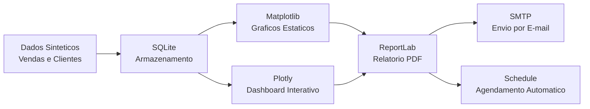

# Automated Report Generator


[Portugues](#portugues) | [English](#english)

---

## Portugues

### Sobre

Gerador automatizado de relatorios PDF com analise de vendas, graficos matplotlib e envio por e-mail.

O modulo principal (`src/report_generator.py`, ~440 linhas) faz o seguinte:

- Gera dados sinteticos de vendas e clientes (simulacao com sazonalidade)
- Armazena dados em banco SQLite
- Cria graficos estaticos com matplotlib (tendencia diaria, por categoria, por regiao, mensal)
- Cria dashboard interativo com Plotly
- Gera relatorios PDF completos com ReportLab (tabelas KPI, graficos embutidos)
- Envia relatorios por e-mail via SMTP
- Agendamento automatico com a biblioteca `schedule` (semanal e a cada 30 dias)

Tambem inclui um stub de API web Flask (`src/app.py`) com endpoints basicos.

### Arquitetura do Pipeline



### Como Executar

```bash
# Clonar o repositorio
git clone https://github.com/galafis/Automated-Report-Generator.git
cd Automated-Report-Generator

# Criar ambiente virtual
python -m venv venv
source venv/bin/activate  # Windows: venv\Scripts\activate

# Instalar dependencias
pip install -r requirements.txt

# Gerar relatorio
python src/report_generator.py
```

Os arquivos gerados ficam no diretorio `reports/`:
- `sales_report_YYYYMMDD.pdf` — relatorio PDF
- `sales_analysis_charts.png` — graficos matplotlib
- `interactive_dashboard.html` — dashboard Plotly

### Testes

```bash
pytest tests/ -v
```

### Estrutura do Projeto

```
Automated-Report-Generator/
├── src/
│   ├── __init__.py
│   ├── report_generator.py   # Modulo principal (~440 linhas)
│   └── app.py                # Stub Flask API
├── tests/
│   └── test_report_generator.py
├── docs/
│   └── assets/
│       ├── workflow_en.mmd    # Diagrama Mermaid (EN)
│       └── workflow_pt.mmd    # Diagrama Mermaid (PT)
├── requirements.txt
├── LICENSE
└── README.md
```

### Tecnologias

| Tecnologia | Uso |
|---|---|
| Python | Linguagem principal |
| pandas / numpy | Geracao e manipulacao de dados |
| matplotlib | Graficos estaticos |
| Plotly | Dashboard interativo |
| ReportLab | Geracao de PDF |
| SQLite | Armazenamento de dados |
| schedule | Agendamento de tarefas |
| Flask | API web (stub) |

### Autor

**Gabriel Demetrios Lafis**
- GitHub: [@galafis](https://github.com/galafis)
- LinkedIn: [Gabriel Demetrios Lafis](https://linkedin.com/in/gabriel-demetrios-lafis)

### Licenca

MIT — veja [LICENSE](LICENSE).

---

## English

### About

Automated PDF report generator with sales analytics, matplotlib charts, and email delivery.

The main module (`src/report_generator.py`, ~440 lines) does the following:

- Generates synthetic sales and customer data (seasonal simulation)
- Stores data in SQLite database
- Creates static charts with matplotlib (daily trend, by category, by region, monthly)
- Creates interactive dashboard with Plotly
- Generates complete PDF reports with ReportLab (KPI tables, embedded charts)
- Sends reports via email (SMTP)
- Automatic scheduling with the `schedule` library (weekly and every 30 days)

Also includes a Flask web API stub (`src/app.py`) with basic endpoints.

### How to Run

```bash
# Clone the repository
git clone https://github.com/galafis/Automated-Report-Generator.git
cd Automated-Report-Generator

# Create virtual environment
python -m venv venv
source venv/bin/activate  # Windows: venv\Scripts\activate

# Install dependencies
pip install -r requirements.txt

# Generate report
python src/report_generator.py
```

Generated files go to the `reports/` directory:
- `sales_report_YYYYMMDD.pdf` — PDF report
- `sales_analysis_charts.png` — matplotlib charts
- `interactive_dashboard.html` — Plotly dashboard

### Tests

```bash
pytest tests/ -v
```

### Project Structure

```
Automated-Report-Generator/
├── src/
│   ├── __init__.py
│   ├── report_generator.py   # Main module (~440 lines)
│   └── app.py                # Flask API stub
├── tests/
│   └── test_report_generator.py
├── docs/
│   └── assets/
│       ├── workflow_en.mmd    # Mermaid diagram (EN)
│       └── workflow_pt.mmd    # Mermaid diagram (PT)
├── requirements.txt
├── LICENSE
└── README.md
```

### Tech Stack

| Technology | Usage |
|---|---|
| Python | Primary language |
| pandas / numpy | Data generation and manipulation |
| matplotlib | Static charts |
| Plotly | Interactive dashboard |
| ReportLab | PDF generation |
| SQLite | Data storage |
| schedule | Task scheduling |
| Flask | Web API (stub) |

### Author

**Gabriel Demetrios Lafis**
- GitHub: [@galafis](https://github.com/galafis)
- LinkedIn: [Gabriel Demetrios Lafis](https://linkedin.com/in/gabriel-demetrios-lafis)

### License

MIT — see [LICENSE](LICENSE).
