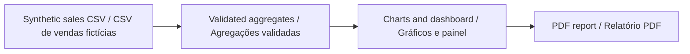

# Sales Reporting Pipeline

### Pipeline de Relatórios de Vendas

[](https://github.com/galafis/Automated-Report-Generator/actions/workflows/ci.yml)
[English](#english) · [Português](#portugues) · [Examples / Exemplos](examples/review_demo.py) · [Validation / Validação](docs/VALIDATION.md)

**Reporting and analytics / Relatórios e análise** · Working prototype / Protótipo funcional · Gabriel Demetrios Lafis

<a id="english"></a>

## English

Turn sales records into validated summaries, static charts, an interactive HTML dashboard and a PDF report using pandas, Matplotlib, Plotly and ReportLab.

### What works

- Daily metrics aggregate all rows for each day; monthly groups retain the year.
- Partial-year data and zero-order examples are supported without dividing by zero.
- Charts, HTML and PDF rendering functions are available independently from optional scheduling and email methods.

### Reproducible walkthrough

Requirements: Python 3.12 / Python 3.12.

Run from the repository root. The validation environment installs the components exercised by the tests and documented example; optional integrations may need their separate dependencies.

```sh
python -m venv .venv
# Activate .venv for your shell / Ative .venv no seu terminal
python -m pip install -r requirements-validation.txt
python -m pytest -q
python -m examples.review_demo
```

**Input contract / Contrato de entrada:** CSV columns / colunas CSV: `date,sales_amount,orders,customers,product_category,region`.

**Expected behavior / Comportamento esperado:** Sample sales total 600 across 12 orders; order average 50; daily average 200; January 2024 and January 2025 remain separate. / Vendas de 600 em 12 pedidos; média por pedido 50; média diária 200; janeiro de 2024 e de 2025 separados.

### Architecture / Arquitetura


```mermaid
flowchart LR
    A["Synthetic sales CSV / CSV de vendas fictícias"]
    B["Validated aggregates / Agregações validadas"]
    C["Charts and dashboard / Gráficos e painel"]
    D["PDF report / Relatório PDF"]
    A --> B --> C --> D
```

The main path can be followed in [src/report_generator.py](src/report_generator.py). Examples call the actual implementation and include assertions; they are not pseudocode.

### Scope and assumptions

The example uses synthetic sales and sends no email. Financial values use ordinary numeric analytics and are not an accounting ledger. Existing email and scheduler methods require explicit configuration and are not exercised by the walkthrough.

### Changes verified in this review

Fixed daily aggregation, year-aware month grouping, partial-period chart labels and zero-order handling; removed default config-file writes and made synthetic sample generation reproducible.

<a id="portugues"></a>

## Português

Transforme registros de vendas em resumos validados, gráficos estáticos, painel HTML interativo e relatório PDF usando pandas, Matplotlib, Plotly e ReportLab.

### Funcionalidades disponíveis

- Métricas diárias agregam todas as linhas do dia; agrupamentos mensais preservam o ano.
- Dados de períodos parciais e exemplos sem pedidos são tratados sem divisão por zero.
- Funções de gráficos, HTML e PDF podem ser usadas independentemente dos métodos opcionais de agendamento e email.

### Execução reproduzível

Use os comandos da seção acima a partir da raiz do repositório. Requisitos: Python 3.12 / Python 3.12. O ambiente de validação instala os componentes exercitados pelos testes e pelo exemplo documentado; integrações opcionais podem exigir dependências próprias.

O fluxo principal está em [src/report_generator.py](src/report_generator.py). Os exemplos usam a implementação real e verificam resultados com asserções; não são pseudocódigo. O diagrama apresenta os mesmos passos nos dois idiomas.

### Escopo e premissas

O exemplo usa vendas fictícias e não envia email. Valores usam análise numérica comum e não constituem livro contábil. Os métodos de email e agendamento exigem configuração explícita e não são executados no roteiro.

### Melhorias verificadas nesta revisão

Corrigidos agregação diária, agrupamento mensal por ano, rótulos de períodos parciais e ausência de pedidos; removida gravação automática de configuração padrão e tornados reproduzíveis os dados fictícios.

## Render the complete example / Gerar o exemplo completo

```sh
python -m examples.render_report --output-dir reports/example
```

EN: This command reads `examples/sales.csv` and produces a bilingual PDF, chart image and HTML dashboard locally. It does not invoke email or scheduling.

PT: O comando lê `examples/sales.csv` e produz localmente PDF bilíngue, gráfico e painel HTML. Não executa email nem agendamento.

## Repository guide / Guia do repositório

| Location / Local                                            | Purpose / Finalidade                                                   |
| ----------------------------------------------------------- | ---------------------------------------------------------------------- |
| [Implementation / Implementação](src/report_generator.py)   | Main domain behavior / Comportamento principal do domínio              |
| [Example / Exemplo](examples/review_demo.py)                | Executable scenario / Cenário executável                               |
| [Tests / Testes](tests/)                                    | Normal behavior and failure cases / Fluxos válidos e casos de falha    |
| [Validation notes / Notas de validação](docs/VALIDATION.md) | Corrections, evidence and boundaries / Correções, evidências e limites |
| [Workflow / Automação](.github/workflows/ci.yml)            | Automated checks / Verificações automatizadas                          |

- [Executed example result / Resultado executado do exemplo](examples/expected.json)

## Development / Desenvolvimento

EN: When changing behavior, update the contract, the worked example and a regression test together. Keep synthetic fixtures separate from real data. A passing test suite demonstrates the listed software behaviors; it does not certify a deployment or domain outcome.

PT: Ao alterar comportamento, atualize em conjunto o contrato, o exemplo e um teste de regressão. Separe amostras fictícias de dados reais. Testes aprovados demonstram os comportamentos de software listados; não certificam implantação nem resultado no domínio.

Author / Autor: [Gabriel Demetrios Lafis](https://github.com/galafis) · [Institutional contact / Contato institucional](mailto:gabrieldemetrioslafis@usp.br)

License / Licença: [repository license](LICENSE).

## Additional contract checks · Verificações adicionais de contrato

PDF data provenance is explicit: generate_pdf_report(..., synthetic=True) labels a synthetic example; the default labels supplied data without asserting its origin. The documented fictional example passes the flag explicitly. Interactive chart titles and labels are bilingual.

A origem dos dados do PDF é explícita: generate_pdf_report(..., synthetic=True) identifica um exemplo fictício; o padrão identifica dados fornecidos sem afirmar sua origem. O exemplo fictício documentado informa a opção explicitamente. Títulos e rótulos dos gráficos interativos são bilíngues.
